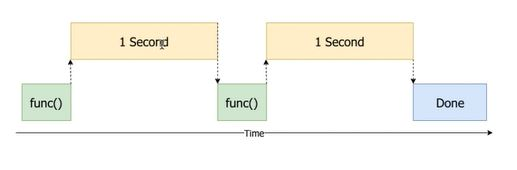

<h2>Multiprocessing to Speed Work Up</h2>

<h3>Intro</h3>
<ul>
  <li>Using multiprocessing for resizing about 1000 photos into lower fixed size for offerting catalogue.</li>
  <li>It can be done either in standard synchronous way of looping through files or by resizing all filess at onece utilising multiprocessing.</li>
  <li>Dividing main proces into many sub-processes running in parallel saves a lot of time.</li>
</ul>

<h3>Comparison</h3>
<ul>
  <li>Credits go to http://coreyms.com/</li>
   
  <table>
    <tr>
      <th>Multiprocessing</th>
      <th>Synchronoues execution</th>
    </tr>
    <tr>
      <th> </th>
      <th> </th>
    </tr>
  </table>
</ul>

<h3>Demo</h3>
<ul>
  <li>With standard synchronous process using foor loop through the collection of file, resizing all the images takes 30 secs.</li>
  <li>With multiprocessing, resizing all the images takes abot 9 secs.</li>
   
  
</ul>
